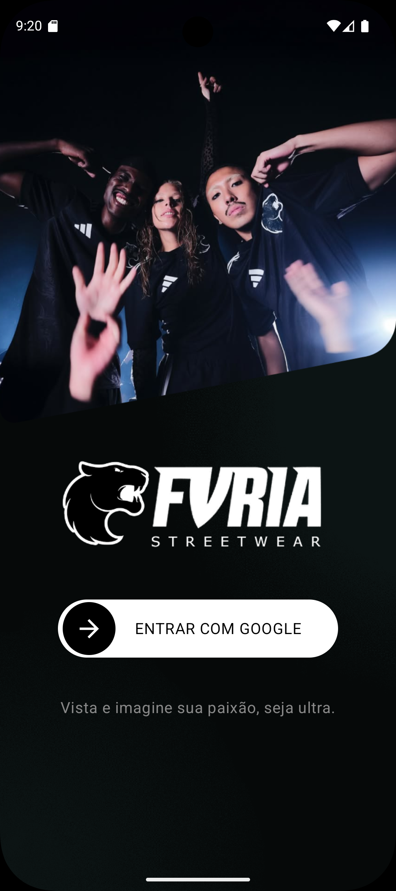
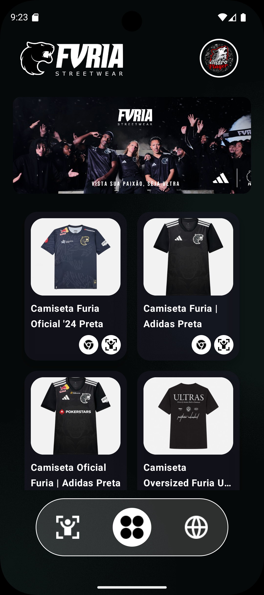
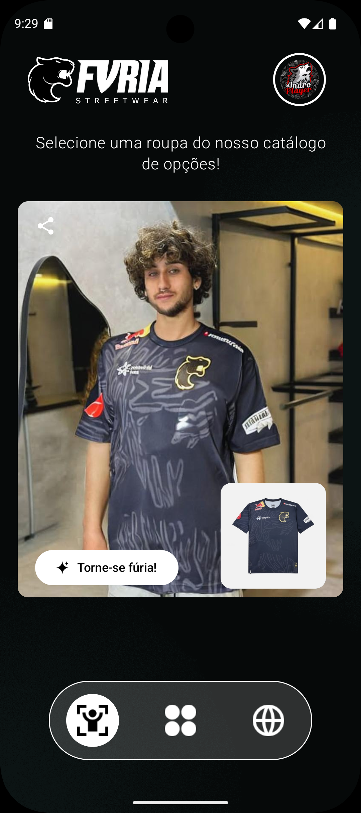
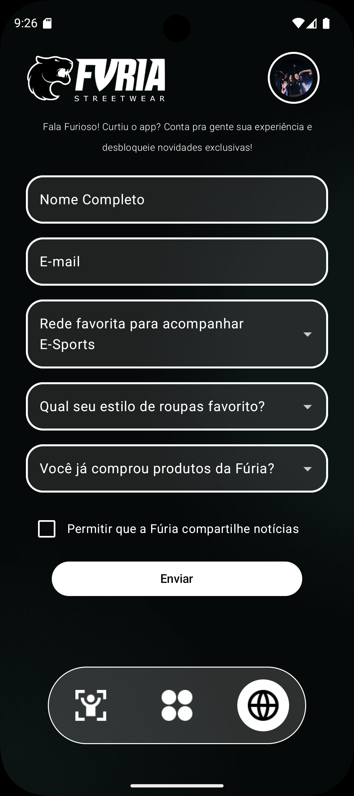

<div align="center">
  
  <h1> Furia Streetwear : Technical App Challenge </h1>
</div>

## Tecnologias Utilizadas
[](https://skillicons.dev)

## Objetivo

Desenvolver uma aplicação mobile para o time FURIA E-Sports, integrando recursos de Inteligência Artificial com o propósito de fortalecer a conexão com os fãs e aprimorar suas experiências de interação.

## Serviço

Criado utilizando Node.JS com o framework Express.Js, utiliza a integração com o SDK Segmind para a criação de um serviço back-end de processamento de imagens, interligando a inteligência artifical
e a aplicação mobile.

O serviço provém rota de integração e processamento de imagem e o scrapping para realizar a filtragem de produtos dísponiveis no site furia.gg

### Tecnologias Utilizadas

- **Node.js**: Ambiente de execução JavaScript no back-end.
- **Express.js**: Framework para gerenciamento de rotas e middlewares.
- **Axios**: Cliente HTTP para realizar chamadas de APIs externas.
- **Cheerio**: Biblioteca para web scraping, permitindo a extração de informações do HTML.
- **dotenv**: Carregamento de variáveis de ambiente de forma segura.
- **Segmind SDK/API**: Serviço de processamento de imagens utilizando inteligência artificial.

### Funcionamento das Rotas

#### Retornar produtos do site Furia.GG
`GET /products` Rota para obter os produtos do site da furia.gg, retorna um .JSON com os campos "nome, image e link",
- **name** : Retorna o nome completo do produto, recomendado formatar string para exibir no layout
- **image** : Retorna o url para exibir a imagem do produto
- **link** : Retorna o link do produto para acesso no site furia.gg

```json
{
  "name": "Camiseta Furia 2024",
  "image": "https://example.com/camiseta-furia-2024.jpeg",
  "link": "https://furia.gg/camiseta-furia-2024"
}
```

#### Renderizar imagem com IA
`POST /try-on` Rota para enviar a imagem do produto e a pose de modelo para renderizar a imagem com IA, retorna uma imagem .jpeg em `Base64`,
- Esta rota espera um Content-Type/Json, envie um DTO ou corpo Json com os campos "cloth_image" e "pose_image". Garanta que esses parâmetros como link
de imagens registradas em um serviço web, como por exemplo AWS.

```json
{
  "cloth_image": "https://example.com/product_image",
  "pose_image": "https://example.com/pose_Image",
}
```

- O retorno virá como um Buffer de Base64, para exibir a imagem garanta que seu programa possa converter o valor de `Base64`

```json
{
  "image": "afy72123omdabwu923810238fbadusamofam231",
}
```

### Firebase

O formulário serviço FireBase fica como responsável por manter a autenticação de usuários utilziando a conta Google e receber os formulários do usuário.

#### Formulário de experiência do usuário

- **Nome Completo** : Nome completo do usuário
- **Email** : E-mail do usuário, pode ser diferente da conta do google
- **Rede Favorita** : Campo de seleção para definir sua rede social favorita para acompanhar a furia ex: Twitter/X, Instagram, Youtube.
- **Estilo favorito** : Campo de seleção para que o usuário escolha seu estilo favorito
- **Adiquiriu Produto** : Campo de seleção para definir se o usuário é um cliente ativo da furia.
- **Autorizo compartilhar noticias** : Autorização para receber noticias e novas pesquisas de conteúdo relacionado a furia.

## Aplicativo Mobile

Criado utilizando a linguagem Kotlin nativamente, utiliza a biblioteca Jetpack Compose para a criação de interfaces e manipulação de UX/UI.

### Tecnologias Utilizadas

- **Kotlin**: Linguagem nativa versão mais recente.
- **Jetpack Compose**: Biblioteca de criação de interfaces nativas com Kotlin.
- **Koin**: Biblioteca de injeção de dependências.
- **Ktor**: Biblioteca para requisição de serviços HTTP e APIRest.
- **MVVM**: Arquitetura de desing-pattner para escalabilidade e produção de apps utilizando ViewModel.
- **Cloundinary**: Serviço de hospedagem de imagens.

### Capturas de Tela

<div align="center">
  
  
  
  
</div>

### Login

Está é a tela incial do aplicativo onde o usuário irá realizar seu login através de uma conta do Google o qual está autenticada no dispositivo,
lembrando que se o usuário não tiver uma conta dísponivel o login não será efetuado.

### Home

Tela incial após realizar o login, o usuário poderá selecionar a roupa a qual deseja experimentar e ela será transportada para a tela de vestuário, caso ele clique no botão do chrome
será redirecionado ao navegador para que possa conferir o produto no site oficial da furia.

### Try-On (Vestuário)

Tela onde o usuário irá anexar sua foto para experiementar a roupa selecionada via IA, ao clicar em "Torne-se fúria" a imagem será processada e começar a carregar o processamento de transformação 
da imagem, quando a imagem estiver pronta o usuário pode usar o botão de compartilhamento na parte superior esquerda para enviar a suas redes sociais ou realizar o download da imagem.

### Formulário

Tela onde o usuário irá preencher o formulário de experiência para poder dar seu feedback do app.

## Desenvolvimento

As camadas de abstração foram separadas em `data` e `ui`. A camada `data` contém todas as classes e interfaces responsáveis pela configuração de injeção de módulos, como o módulo de rede e os repositórios de acesso. O `ImageRepository` encapsula toda a lógica de inserção das imagens no serviço do Cloudinary e o envio das imagens para o serviço `furia-try-on` (back-end feito em Node.js). Já o `ProductRepository` é responsável pela lógica de obtenção dos produtos.

Os repositórios possuem um serviço `HttpClient` acoplado com injeção de dependências. Isso permite que os repositórios possam trocar de serviço de requisições no futuro, caso necessário. Atualmente, estamos utilizando o Ktor, mas com a abstração criada, será possível substituir o serviço por Retrofit sem a necessidade de reescrever todo o código de cada repositório.

Os `ViewModels` são encarregados de manipular a execução das funções back-end do aplicativo a partir de cada contexto. Eles são instanciados na `MainActivity` para serem construídos assim que o app for iniciado. Isso ocorre para garantir que a troca de telas não refaça a construção dos `ViewModels` durante a navegação do app. Os `ViewModels` recebem os repositórios necessários para cada função e já tratam as exceções, deixando o `ViewModel` apenas responsável pelos erros de conexão de rede, caso ocorram.

Além disso, utilizamos classes `sealed` para representar o `UiState`, com três estados: `Loading`, `Success` e `Error`. O estado `Loading` é utilizado enquanto a resposta da requisição está sendo aguardada, o estado `Success` carrega o tipo de informação ou objeto esperado da resposta, e o estado `Error` traz uma mensagem de erro para a interface caso ocorra. Dessa forma, nenhuma variável local será inicializada nas telas, mantendo a persistência das informações no background do app e garantindo uma melhor performance e usabilidade no código.


<h1 align="center">
   Developed by Rhyan Araujo Chaves @2024
</h1>
